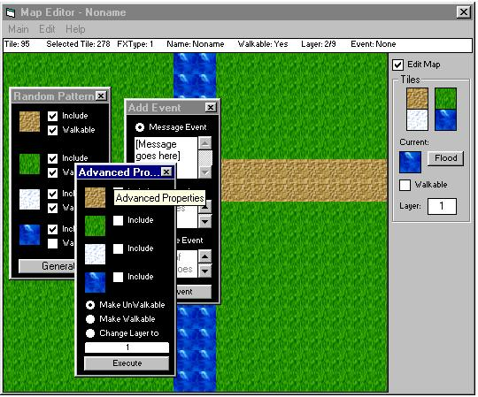



## Good Map Editor \(Version 1\.5\)

### Description

This is a update of the previous version, witch was given complains about to many picture boxes. So here's another better version that runs faster and has more features. Please vote and give comments.
 
### More Info
 

             |
---                |---
**Submitted On**   |2002-04-30 08:04:16
**By**             |[ReXz](https://github.com/Planet-Source-Code/PSCIndex/blob/master/ByAuthor/rexz.md)
**Level**          |Intermediate
**User Rating**    |4.0 (8 globes from 2 users)
**Compatibility**  |VB 6\.0
**Category**       |[Games](https://github.com/Planet-Source-Code/PSCIndex/blob/master/ByCategory/games__1-38.md)
**World**          |[Visual Basic](https://github.com/Planet-Source-Code/PSCIndex/blob/master/ByWorld/visual-basic.md)
**Archive File**   |[Good\_Map\_E774864302002\.zip](https://github.com/Planet-Source-Code/rexz-good-map-editor-version-1-5__1-34240/archive/master.zip)

